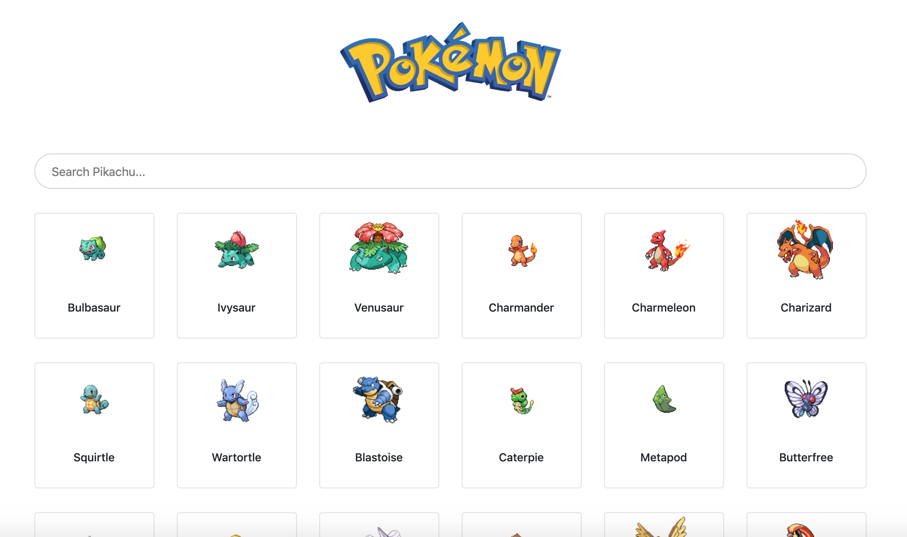

## Pikachu Finder

This is a fun project build with [PokeAPI](https://pokeapi.co/) where you can find your favorite pikachu and know more details about them.

### Live (http://aboriginal-pokemon.surge.sh/)

### Project Description:
 * List Page:
    - List the pikachu from (https://pokeapi.co/) - Number of Pikachu to list is configurable
    - It has a search feature which searches by keyword
    - You can see the details of each Pikachu once you click on each of them

* Pikachu Details Page: 
    - Lists the description of each pikachu
    - can go back to previous listing page with go button

### Getting Started
To get you started you can simply clone the repository:

```
git clone https://github.com/Rajdeepc/pikachu-story.git
```

### Prerequisites
You need git to clone the repository. You can get git from
[http://git-scm.com/](http://git-scm.com/).

A number of node.js tools is necessary to initialize and test the project. You must have node.js and its package manager (npm) installed. You can get them from  [http://nodejs.org/](http://nodejs.org/).

### Installing

and install the dependencies
```
npm install
```

#### Lint & Build

```sh
npm run lint
npm run build
```

### Running the tests
```
npm test
```

### Run in Local

To Run Locally Steps to follow:

```
npm start

```
### Built With

* [React js](https://github.com/facebook/react/)
* [Reslect](https://github.com/reduxjs/reselect)
* [React Bootstrap](https://react-bootstrap.github.io/)
* [Redux](https://github.com/reduxjs/redux)
* [React-Router 3](https://github.com/ReactTraining/react-router)


## Contributing

### Create a branch

1. `git checkout master` from any folder in your local `https://github.com/Rajdeepc/pikachu-story.git` repository
1. `git pull origin master` to ensure you have the latest main code
1. `git checkout -b the-name-of-my-branch` (replacing `the-name-of-my-branch` with a suitable name) to create a branch

### Make the change

1. Follow the "Running locally" instructions
1. Save the files and check in the browser
  1. Changes to React components in `src` will hot-reload
  1. Changes to markdown files in `content` will hot-reload
  1. If working with plugins, you may need to remove the `.cache` directory and restart the server


### Push it

1. `git add -A && git commit -m "My message"` (replacing `My message` with a commit message, such as `Fixed header logo`) to stage and commit your changes
1. `git push my-fork-name the-name-of-my-branch`
1. Go to the [pikachu-story](https://github.com/Rajdeepc/pikachu-story.git) and you should see recently pushed branches.
1. Follow GitHub's instructions.
1. If possible, include screenshots of visual changes. A Netlify build will also be automatically created once you make your PR so other people can see your change.

### Some Glimpses:

## Pokemon Listing Page


## Details Page


#### This project was a part of ReactJS community examples by @alik0211 . I have used the idea to create my own with the help of Reselect library and Redux.cd